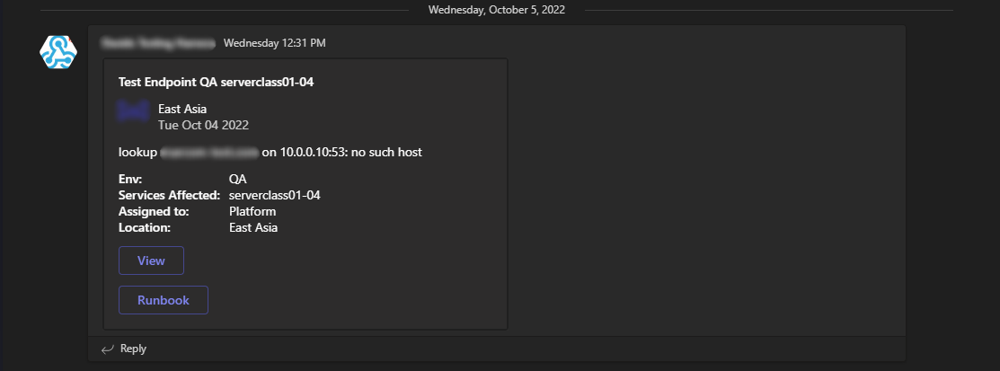

# AdaptiveCardService

A simple NodeJS express service that accepts a payload and broadcasts a formatted Adaptive Card to a provided Teams channel

# Getting Started

For local testing:
1. Clone this repo `git clone https://github.com/CrunchyBlue/AdaptiveCardService.git`
2. For development/testing create a `.env` file containing the following environment variables
   1. `WEBHOOK_URL` The webhook url associated with the Teams channel you wish to broadcast to.
      1. <a href="https://learn.microsoft.com/en-us/microsoftteams/platform/webhooks-and-connectors/how-to/add-incoming-webhook for more information">Click Here</a> for more information on setting up incoming web hooks in Microsoft Teams
   2. `APP_PORT` The port the listen on for development. Defaults to `3000`.
   3. `IMAGE_URL` The URL of an image to render within the adaptive card.
3. Install node packages `npm install`
4. Run `npm run dev` to enable hot reload
5. Run `npm run build && npm start` to build production app and start locally

For Docker:
1. Clone this repo `git clone https://github.com/CrunchyBlue/AdaptiveCardService.git`
2. For development/testing create a `.env` file containing the following environment variables
   1. `WEBHOOK_URL` The webhook url associated with the Teams channel you wish to broadcast to.
      1. <a href="https://learn.microsoft.com/en-us/microsoftteams/platform/webhooks-and-connectors/how-to/add-incoming-webhook for more information">Click Here</a> for more information on setting up incoming web hooks in Microsoft Teams
   2. `APP_PORT` The port the listen on for development. Defaults to `3000`.
   3. `IMAGE_URL` The URL of an image to render within the adaptive card.
3. Run `docker compose up` For local development to allow hot reload within the container (Note: Port 3000 is mapped to the APP_PORT environment variable so service is reachable at localhost:3000)
4. Run `docker build -t <username>/<repository>:<tag> .` to build a production image
5. Production image can be tested locally by running `docker run -dp 3000:<APP_PORT> --env-file .env <username>/<repository>:<tag>`

# Payload Schema

The default expected payload is defined by the JSON Schema found at `<host>:<port>/schema` e.g. `localhost:3000/schema`

# Example Payload

```
{
    "source": "heartbeat",
    "viewUrl": "https://example.com",
    "documents": [
      {
          "title": "Test Endpoint",
          "description": "lookup example.com on 10.0.0.10:51: no such host",
          "location": "East Asia",
          "createdDate": "2022-10-04T18:01:49.618Z",
          "tags": "QA,serverclass01-04,Platform"
      },
      {
          "title": "Test Endpoint",
          "description": "lookup example.com on 10.0.0.10:52: no such host",
          "location": "West US",
          "createdDate": "2022-10-04T18:01:47.973Z",
          "tags": "QA,serverclass01-04,Engineering"
      },
      {
          "title": "Test Endpoint",
          "description": "lookup example.com on 10.0.0.10:53: no such host",
          "location": "West Europe",
          "createdDate": "2022-10-04T18:01:45.772Z",
          "tags": "QA,serverclass01-04,Platform"
      },
      {
          "title": "Test Endpoint",
          "description": "lookup example.com on 10.0.0.10:54: no such host",
          "location": "Central US",
          "createdDate": "2022-10-04T17:58:27.471Z",
          "tags": "QA,serverclass01-04,IT"
      },
      {
          "title": "Test Endpoint",
          "description": "lookup example.com on 10.0.0.10:55: no such host",
          "location": "East US",
          "createdDate": "2022-10-04T17:58:22.688Z",
          "tags": "QA,serverclass01-04,Platform"
      }
   ]
}
```

# Example Card

